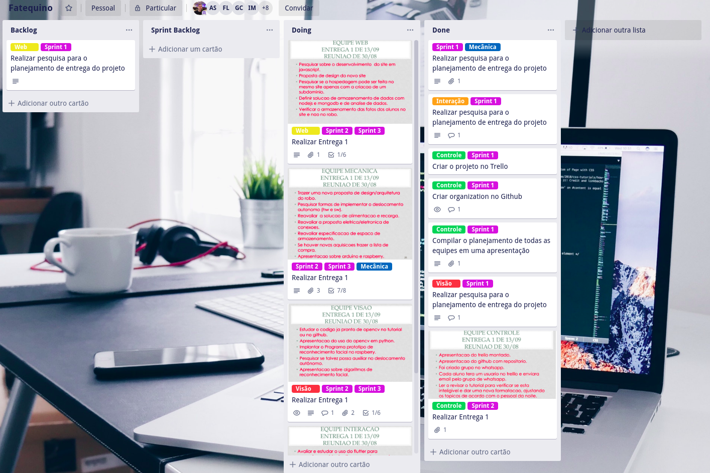

# Projeto Fatequino

Documentação oficial do projeto Fatequino do curso de ADS da FATEC de Carapicuíba (Manhã).

## Sumário

1. [Introdução](#introdução)
2. [Equipes](#equipes)
    * [Controle](#controle)
    * [Web](#web)
    * [Mecânica](#mecânica)
    * [Interação](#interacão)
    * [Visão](#visão)

# Introdução

O projeto Fatequino tem como objetivo geral a realização do planejamento, desenvolvimento e construção de um robô que faça a interação com alunos, professores, funcionários, visitantes e internautas.

Para os alunos participantes, este projeto é uma oportunidade de aplicar na prática os conhecimentos adquiridos durante o curso e desenvolver novos conhecimentos na área de tecnologia.

# Equipes

## Controle

Equipe responsável por controlar todas as etapas do projeto e coordenar as atividades de cada uma das equipes.

### Gestão do Projeto

A gestão do projeto é realizada utilizando o framework ágil [SCRUM](https://www.scrum.org/resources/what-is-scrum?gclid=EAIaIQobChMI0oXZ96Tf5AIViIaRCh0nYwh_EAAYASAAEgJSqfD_BwE). As Sprints possuem duração de 1-2 semanas (de acordo com o andamento das entregas).

Utilizamos o [Trello](http://trello.com/) como ferramenta de controle das entregas, onde cada equipe possui uma _label_ em suas atividades que dizem respeito à sua equipe (ex: mecânica, interação e etc) e uma _label_ com o número da Sprint em que aquela atividade foi priorizada (ex: Sprint 1, 2, etc):

O controle da documentação do projeto e da _organization_ [fatequino-manha](https://github.com/fatequino-manha) também é de responsabilidade desta equipe.

## Web

Equipe responsável por pesquisar e desenvolver a solução de presença na web do fatequino. Atualmente, possuímos um [site](https://fatequino.com.br/) que pode ser melhorado/alterado para o bom andamento do projeto.

Os requisitos de entrega são:

- Site na Web para interação com os usuários.
- Chatbot para interação na Web.
- Armazenamento de dados para fins estatísticos.
- Disponibilização de informações da Fatec.

## Mecânica

Esta equipe é responsável por pesquisar e desenvolver a solução básica de movimentação, alimentação e construção do fatequino (robô).

Os requisitos de entrega são:

- Deslocamento.
- Alimentação e recarga.
- Autonomia.

## Interação

Esta equipe é responsável por pesquisar e desenvolver a solução de interação do fatequino com alunos, professores, funcionários e visitantes. 

Os requisitos de entrega são:

- Sistema de comunicação audível.
- Conversação.
- Esclarecimento de dúvidas sobre por exemplo localização de salas de aula, disciplinas por sala, sala dos professores, etc.
- Armazenamento de conversas para fins de levantamentos estatísticos.

## Visão

Esta equipe é responsável por pesquisar e desenvolver a solução de identificação e reconhecimento visual de alunos, professores, funcionários e visitantes.

Os requisitos de entrega são:

- Identificar visualmente pessoas.
- Auxiliar no deslocamento autônomo do robô.

## Licença

Este projeto está sobre a Licença MIT - veja o arquivo [LICENSE](LICENSE) para mais detalhes.