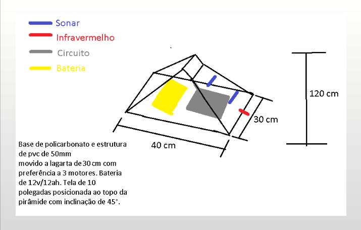

## Robô Fatequino

### Design

Design proposto pela equipe para o robô Fatequino:

### Componentes e Materiais

1. Lista de componentes e materiais utilizados:

2. Bateria Estacionária Vrla ( Agm ) Getpower 12v 12ah Gp12-12:

3. Cano Pvc Para Esgoto 50mm 2 Polegadas - 6 Metros

4. Retalho De Policarbonato 1mm X 400mm X 3000mm

5. Adesivo Plástico P/ Pvc Incolor Bisnaga 17g Tigre

6. Cola Adesiva Instantânea Tek Bond 793 100g

7. Chassi Robô Tanque Oversize Esteira Lagarta Arduino Robótica

8. Sensor Hcsr04 Distancia Sonar Ultrassonico Arduino Pic

9. Sensor De Obstáculo Infravermelho Reflexão Lm393 P/ Arduino
