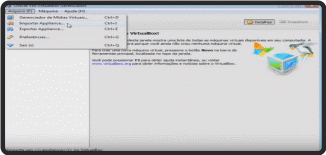
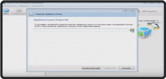
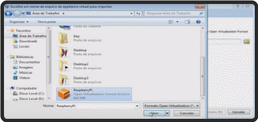
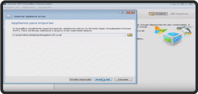
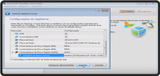
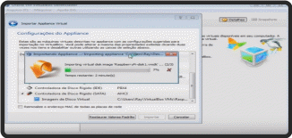
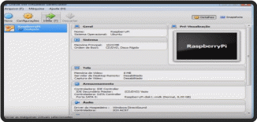
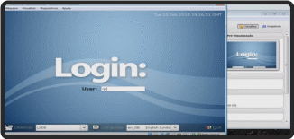

## Instalação do Raspberry

### Passo-a-passo

Realizar o download através deste [link](magnet:?xt=urn:btih:A812A403006D5F49CB1E3E891243B927AE1DD016&dn=RaspberryPi.ova&tr=udp%3a%2f%2ftracker.openbittorrent.com%3a80%2fannounce).

Após a conclusão do download, seguir as imagens abaixo:

### Referências

https://www.youtube.com/watch?v=ZEif2ReUVic (acesso em 20 de Outubro de 2019).
